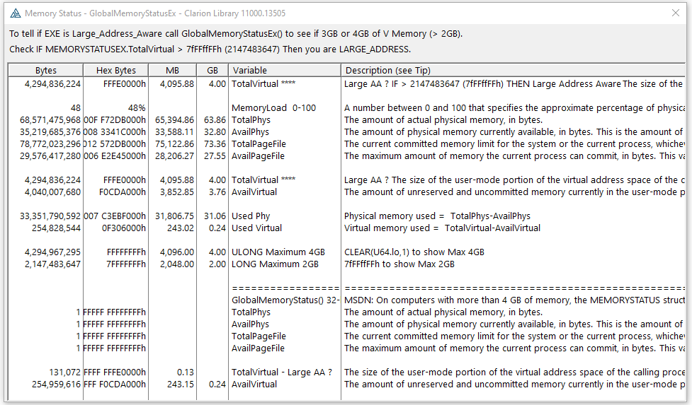

# Large Address Memory Status

 LARGE_ADDRESS in the EXP file of the EXE will allow the process to have more than 2GB of memory. With 32-bit Windows Server Edition you could get 3GB if it was the machine was booted with a special /3GB switch. With 64-bit Windows both Desktop and Server get almost 4GB without any special boot switch or setting. Note that LARGE_ADDRESS is only specified in the EXE project, it can appear in DLL projects but it will be ignored. In the Microsoft world this is the /LARGEADDRESSAWARE linker switch that turns on the IMAGE_FILE_LARGE_ADDRESS_ AWARE bit in the PE Header Characteristics field flags.  

 A potential problem with LAA is an address above 2 GB is negative
 when stored in a LONG (signed 32-bit integer). The first 4kb of memory address is reserved to catch
 null pointer assignments so I had code checking for a bad address as `IF Address < 0FFFFh THEN
 STOP('Bad').`. That worked until LARGE_ADDRESS was enabled and an Address was allocated above 2GB so was negative. I changed the code to `IF Address >=0 AND Address < 0FFFFh THEN
 STOP('Bad').`. An alternate would be to change the Address variable to a ULONG.

 I would not use LARGE_ADDRESS until I was certain I needed that much memory. You can use System
 Internals VMMap to look at how fragmented your app is in memory and how memory
 is used. Cool tool!

 https://docs.microsoft.com/en-us/sysinternals/downloads/vmmap

## MemStatus_LargeAA Clarion Project

 The project in this Repo is configured as LARGE_ADDRESS. Its purpose is to show the results of calling GlobalMemoryStatusEx() to see if you really have 4GB of virtual memory address space. MSDN documents the MEMORYSTATUSEX.ullTotalVirtual member as:

 > The size of the user-mode portion of the virtual address space of the calling process, in bytes. This value depends on the type of process, the type of processor, and the configuration of the operating system. For example, this value is approximately 2 GB for most 32-bit processes on an x86 processor and approximately 3 GB for 32-bit processes that are large address aware running on a system with 4-gigabyte tuning enabled.

https://docs.microsoft.com/en-us/windows/win32/api/sysinfoapi/nf-sysinfoapi-globalmemorystatusex

https://docs.microsoft.com/en-us/windows/win32/api/sysinfoapi/ns-sysinfoapi-memorystatusex

In the below screen capture you see the first line "TotalVirtual" is almost 4GB (FFFE0000h vs FFFFFFFFh) indicating LARGE_ADDRESS in the project and Windows allocated it.

